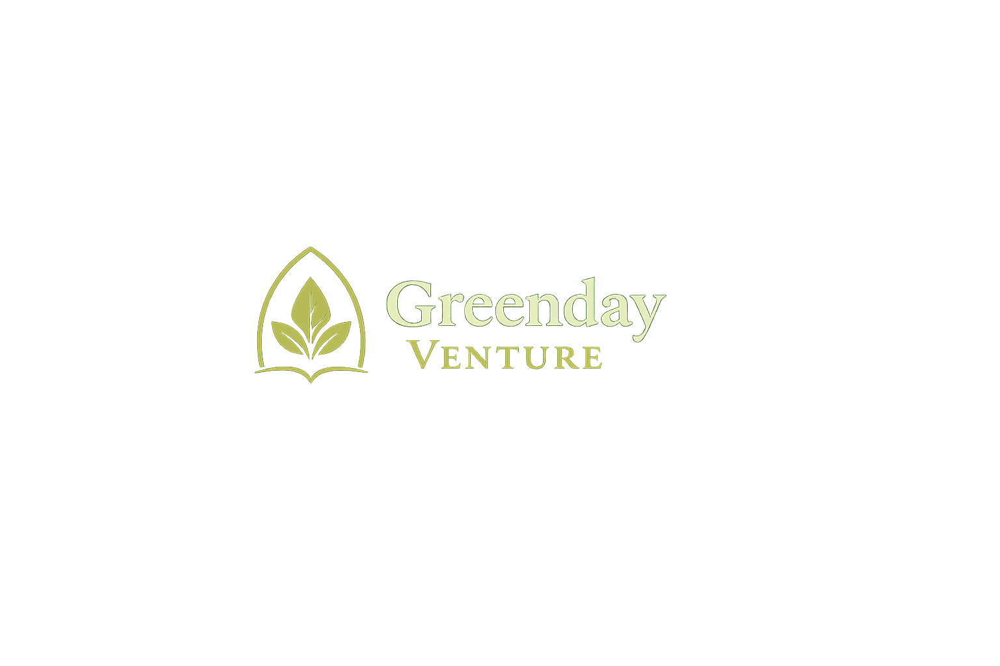

# Greenday Venture — Website

A static, five-page website for Greenday Venture, an Atlanta-based acquisition
and investment firm working with owners of established home-service businesses
on retirement, succession, and long-term ownership transitions.

## Purpose

1. Establish credibility and trust.
2. Explain the acquisition philosophy.
3. Help a qualified owner judge whether there may be a fit.
4. Encourage a confidential conversation.
5. Support referrals from business brokers and M&A professionals.

It is deliberately not a high-volume lead funnel.

## File structure

```
C:\Greenday_Ventures
│
├── index.html       Homepage
├── about.html       Company overview and founder introduction
├── criteria.html    Sectors and company qualities ("What We Look For")
├── process.html     General process overview
├── contact.html     Confidential inquiry page and form
├── styles.css       Single shared stylesheet
├── script.js        Single shared script
├── README.md        This file
├── .gitignore       (preserve if present)
├── .nojekyll        (preserve if present — keep it for GitHub Pages)
└── Assets\
    ├── hero-we-service.png        Original hero photograph (2 MB, preserved)
    ├── hero-we-service.jpg        Optimised 1400px copy — this is what the site loads
    └── jermane-lamb-headshot.jpg  Founder portrait
```

## Local preview

No build step, no package manager, no dependencies.

- Double-click `index.html`, or
- Run a local server for a closer match to production:

```powershell
Set-Location "C:\Greenday_Ventures"
python -m http.server 8000
# then open http://localhost:8000
```

## GitHub Pages compatibility

- Every link and asset path is **relative** (`about.html`, `styles.css`,
  `Assets/jermane-lamb-headshot.jpg`). No root-relative paths are used, so the
  site works from a project subpath such as
  `https://bazeocrisy.github.io/Greenday_Ventures/`.
- Keep `.nojekyll` in the repository root.
- Pages source: `main` / `(root)`.
- Fonts load from Google Fonts. Offline, the site falls back to comparable
  system serif and sans-serif faces and remains fully readable.

## How to update colours

All colours are CSS custom properties in one place: the **Design Tokens** block
at the top of `styles.css`. Change the hex values there and the whole site
follows. Nothing else in the stylesheet hard-codes a colour.

Working values (not client-approved):

| Token | Value | Role |
| --- | --- | --- |
| `--c-green-900` | `#12241c` | Dark backgrounds, header, footer |
| `--c-green-800` | `#1b3428` | Secondary dark |
| `--c-green-700` | `#264736` | Primary buttons, links |
| `--c-sage-400` | `#8ca694` | Muted text on dark |
| `--c-sage-200` | `#c6d2c6` | Body text on dark |
| `--c-ivory` | `#f6f3ea` | Page background |
| `--c-ivory-dim` | `#ece7da` | Alternating sections |
| `--c-charcoal` | `#23282a` | Headings |
| `--c-charcoal-soft` | `#4a5250` | Body text |
| `--c-bronze` | `#8a5c30` | Accent on light backgrounds |
| `--c-bronze-light` | `#c2914f` | Accent on dark backgrounds |

If you replace these, re-check contrast. Body and small text should stay at or
above 4.5:1 against its background.

## How to replace the logo

Each page currently uses a text wordmark:

```html
<a class="wordmark" href="index.html">Greenday <span class="wordmark-accent">Venture</span></a>
```

To use a real logo:

1. Save the file into `Assets\` with a lowercase, web-safe name, e.g. `logo.png`
   or `logo.svg`.
2. In **all five** HTML files, replace the wordmark text with:

```html
<a class="wordmark" href="index.html"></a>
```

3. Set `width` and `height` to the real pixel dimensions so the layout does not
   shift. Do not stretch or distort the mark.

## Images

| File | Used on | Notes |
| --- | --- | --- |
| `Assets/hero-we-service.jpg` | Homepage hero (right side of the split layout) | Editorial support imagery only. It is **not** Jermane Lamb, not a client, and not an acquisition. Nothing on the site may imply otherwise. |
| `Assets/hero-we-service.png` | Nothing — preserved original | 2 MB. Kept unmodified. To load it instead of the JPEG, change the `src` in the hero `<figure>` in `index.html`. |
| `Assets/jermane-lamb-headshot.jpg` | Homepage founder preview and `about.html` | Deliberately kept out of the hero. |

Both images carry explicit `width` and `height` attributes so no layout shift
occurs while they load.

**TODO: Client confirmation required — licence and usage rights for the hero
photograph** before the site is promoted publicly.

## How to connect the inquiry form later

The form in `contact.html` has **no `action` attribute and no endpoint**. It
cannot post anywhere and never claims a message was sent. On submit it
validates, then states plainly that the form is not connected and offers a
pre-filled `mailto:` message.

The submit button is labelled **"Prepare Email"** rather than "Send message",
because pressing it prepares a pre-filled email instead of sending anything.
Change the label back to "Send message" at the same time you connect the
endpoint.

To connect it:

1. Create the endpoint (for example, a Formspree form) and copy its URL.
2. In `contact.html`, add the endpoint to the form tag:

```html
<form class="form" id="inquiry-form" action="https://formspree.io/f/YOUR_ID" method="post">
```

   (Remove `novalidate` if you want native browser validation as well.)
3. In `script.js`, change:

```js
var FORM_ENDPOINT_CONNECTED = false;
```

   to `true`. The script then stops intercepting the submit event.
4. Test an end-to-end submission before announcing the site.

## Client confirmations still required

- Final colour palette and whether these working colours are acceptable
- Official logo files (and favicon)
- Approved founder biography wording
- Approved use of the founder photograph
- Approved public credentials (degree, ITIL, cybersecurity, certifications)
- The nature of any Heritage Wealth Capital relationship and whether it may be
  mentioned at all
- Primary audience priority (owners vs. brokers/advisors)
- Specific Southeast states in scope
- Acquisition financial criteria (revenue, EBITDA, employee count) and whether
  any should be public
- Preferred inquiry workflow (email only, form, or both)
- Whether a booking system such as Calendly should ever be added
- Form processing endpoint
- Response-time commitment, if any
- Final domain name (for canonical and Open Graph URLs)
- Whether a privacy policy page is needed
- Approved LinkedIn or other public profile links
- Licence and usage rights for the hero photograph
- Whether the softened confidentiality wording ("intended to remain private",
  "handled with care") is acceptable, or whether Jermane wants firmer language
  backed by an NDA process
- Definition of website success (inquiries per month, referral quality, etc.)
- Any testimonials, references, or public proof that may be used later

Unconfirmed items are marked in the HTML with comments beginning
`<!-- TODO: Client confirmation required:`. Search the project for that string.

## Unsupported claims intentionally excluded

None of the following appears anywhere in the public copy, because none is
confirmed:

- Completed acquisitions, transaction volume, or assets under management
- Seller results, outcomes, or case studies
- Testimonials, reviews, ratings, or client logos
- Partnerships, affiliations, or professional memberships
- Years of acquisition experience or home-service operating experience
- Revenue or EBITDA thresholds
- Specific target states
- Funding sources or institutional backing
- Any implication that Heritage Wealth Capital or the Department of Defense
  owns, sponsors, endorses, or is affiliated with Greenday Venture
- Certifications, credentials, or degrees
- Guaranteed outcomes or response times
- Online scheduling or booking
- Invented statistics, counters, or metrics
- A postal address or telephone number
- Absolute confidentiality guarantees, or any claim that information is never
  shared with anyone
- Any suggestion that the hero photograph shows Jermane, a client, or a
  completed acquisition

## Deployment

Review the changes locally first, then:

```powershell
Set-Location "C:\Greenday_Ventures"

git status
git add .
git commit -m "Build initial Greenday Venture website"
git push origin main
```

GitHub Pages redeploys from `main` / `(root)` automatically, usually within a
minute or two.
